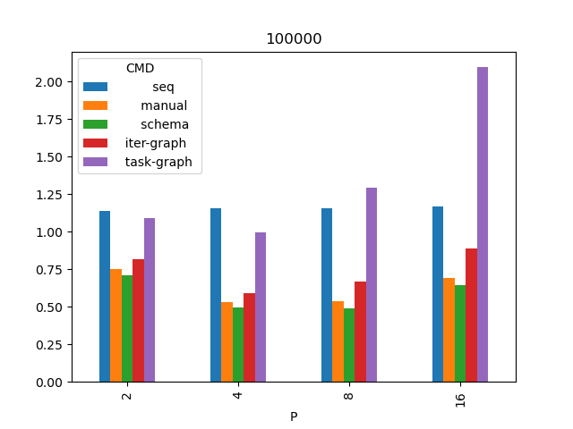
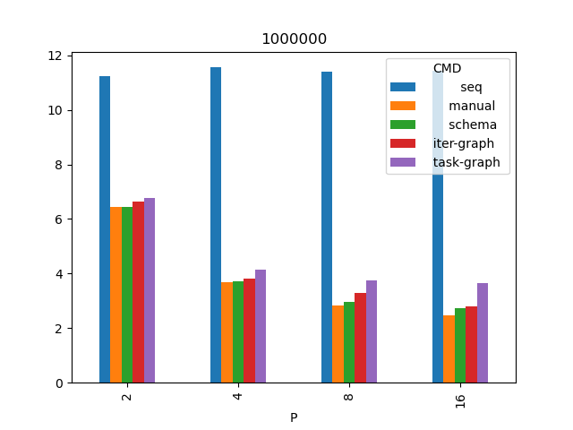
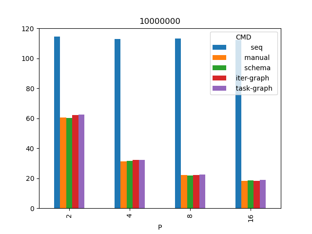

# Сравнение производительности методов распараллеливания

* Вычисляется функция одного переменного на регулярной сетке по явной схеме.
* Используется формула: `p_next = (p_left + p_right)/2 + Math.random(1)`
* Код функции описан в файле [f.js](f.js)

## Примечания
- дожидаемся завершения расчетов всех блоков

### Последовательное вычисление
[sequential.js](sequential.js)

### Граф задач
[task-graph.js](task-graph.js)

### Ручное распараллеливание
[manual.js](manual.js)

### Метод итераций для графа задач
[iter-graph.js](iter-graph.js)

### Метод схем
[schema/trial-comp.js](schema/trial-comp.js)

## Подготовка и запуск теста

```
git clone https://github.com/pavelvasev/ppk.git
cd ppk
git checkout --track origin/pavt2024
npm install
```

Запуск:
```
cd experiments/trial-v2
./start-trial.py
```

## Результаты

Процессор Ryzen 1700x.
Кол-во итераций во всех тестах 1000.
P - количество исполнителей.
b - размер одного блока (кол-во ячеек).
Значения в таблицах - время в секундах.
Запуски проведены в количестве 4х штук и их времена взяты средние.

Текущие результаты - список всех запусков [vis/data.csv](vis/data.csv) и усредненные [vis/mean.csv](vis/mean.csv)

### Сетка 100 тысяч узлов

|   P |     b |            seq  |         manual  |         schema  |     iter-graph  |     task-graph  |
|----:|------:|----------------:|----------------:|----------------:|----------------:|----------------:|
|   2 | 50000 |         1.1375  |        0.752107 |        0.710748 |        0.81822  |        1.09025  |
|   4 | 25000 |         1.15375 |        0.530763 |        0.494561 |        0.590199 |        0.998787 |
|   8 | 12500 |         1.1565  |        0.538079 |        0.490182 |        0.668065 |        1.29175  |
|  16 |  6250 |         1.16875 |        0.689188 |        0.641617 |        0.887447 |        2.0965   |



Наблюдения:
* Граф задач показывает себя особенно плохо, начиная с P=8 работает дольше последовательного случая. Вероятная причина - задачи мелкозернистые, при P=8 это 12.5 тысяч ячеек на одну задачу.
* И ручное распараллеливание, и метод итераций ухудшают свою работу начиная с P=8.
Вероятная причина - их накладные расходы есть коммуникация между процессами исполнителей, и она превосходит вычислительную часть. Необходимо замерять отдельно, чем именно занимаются процессы исполнителей.

### Сетка 1 миллион узлов

|   P |      b |            seq  |         manual  |         schema  |     iter-graph  |     task-graph  |
|----:|-------:|----------------:|----------------:|----------------:|----------------:|----------------:|
|   2 | 500000 |         11.234  |         6.45475 |         6.4345  |         6.63625 |         6.7585  |
|   4 | 250000 |         11.5552 |         3.674   |         3.72075 |         3.83075 |         4.15375 |
|   8 | 125000 |         11.397  |         2.8205  |         2.95575 |         3.27725 |         3.7505  |
|  16 |  62500 |         11.4435 |         2.46575 |         2.738   |         2.8115  |         3.64075 |



### Сетка 10 миллионов узлов

|   P |       b |            seq  |         manual  |         schema  |     iter-graph  |     task-graph  |
|----:|--------:|----------------:|----------------:|----------------:|----------------:|----------------:|
|   2 | 5000000 |         114.424 |         60.6497 |         60.0652 |         62.032  |         62.3713 |
|   4 | 2500000 |         112.756 |         31.3268 |         31.61   |         32.3073 |         32.245  |
|   8 | 1250000 |         113.175 |         22.2578 |         21.6902 |         22.163  |         22.4262 |
|  16 |  625000 |         112.122 |         18.202  |         18.6417 |         18.196  |         18.8615 |



Наблюдения для случая 10 млн:
* P=16 метод итераций отработал лучше чем ручное распараллеливание. Вероятная причина - нестабильность окружения дающая, погрешность времени работы программ.

Общее наблюдение - по видимому, есть диапазоны "зернистости" задач, где разные методы хороши или плохи. Другими словами, "эффективность" метода есть функция от размера (зерна) задачи.
При этом, метод итераций в среднем показывает себя лучше, чем граф задач.
Требуются дополнительные исследования:
- более частые шаги по сетке,
- более сложные в плане коммуникации задачи,
- более значительное количество исполнителей.
