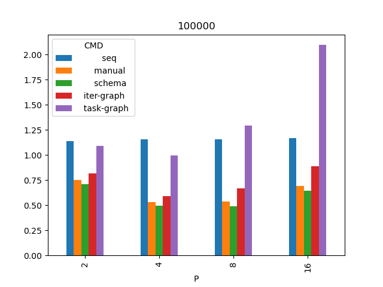
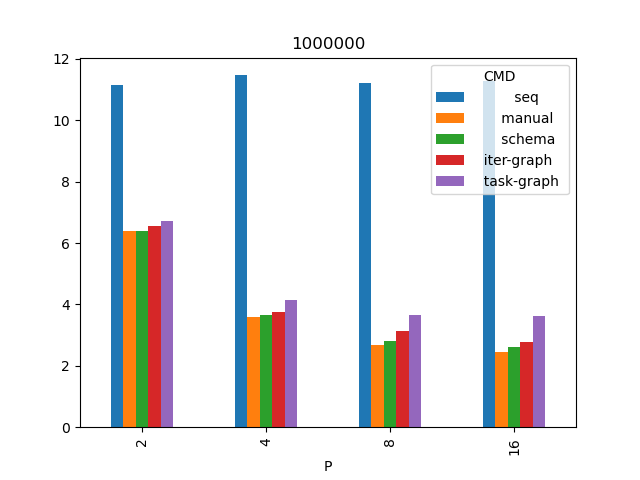
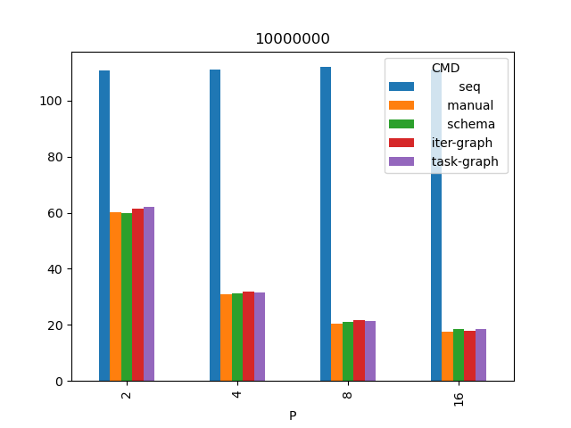

## Результаты

* Кол-во итераций во всех тестах 1000.
* P - количество исполнителей.
* b - размер одного блока (кол-во ячеек).
* Значения в таблицах - время в секундах.
* Запуски проведены в количестве 4х штук и их времена взяты средние.
* Процессор Ryzen 1700x.

Список всех запусков [data.csv](data.csv) и усредненные времена [mean.csv](mean.csv)

### Сетка 100 тысяч узлов

|   P |     b |            seq  |         manual  |         schema  |     iter-graph  |     task-graph  |
|----:|------:|----------------:|----------------:|----------------:|----------------:|----------------:|
|   2 | 50000 |           1.115 |        0.744489 |        0.70504  |        0.805449 |        1.079    |
|   4 | 25000 |           1.114 |        0.518259 |        0.481991 |        0.57722  |        0.970135 |
|   8 | 12500 |           1.125 |        0.526887 |        0.486867 |        0.643821 |        1.269    |
|  16 |  6250 |           1.113 |        0.658226 |        0.627192 |        0.869366 |        2.082    |

Наблюдения:
* Граф задач показывает себя особенно плохо, начиная с P=8 работает дольше последовательного случая. Вероятная причина - задачи мелкозернистые, при P=8 это 12.5 тысяч ячеек на одну задачу.
* И ручное распараллеливание, и метод итераций ухудшают свою работу начиная с P=8.
Вероятная причина - их накладные расходы есть коммуникация между процессами исполнителей, и она превосходит вычислительную часть. Необходимо замерять отдельно, чем именно занимаются процессы исполнителей.
* Метод схем ведет себя лучше чем ручное распараллеливание, что подозрительно. Прим: при повышении кол-ва итераций до 10 тыс ситуация стабилизируется, и ручное становится лучше.

### Сетка 1 миллион узлов

|   P |      b |            seq  |         manual  |         schema  |     iter-graph  |     task-graph  |
|----:|-------:|----------------:|----------------:|----------------:|----------------:|----------------:|
|   2 | 500000 |          11.164 |           6.401 |           6.393 |           6.557 |           6.714 |
|   4 | 250000 |          11.471 |           3.605 |           3.652 |           3.752 |           4.133 |
|   8 | 125000 |          11.219 |           2.688 |           2.794 |           3.142 |           3.665 |
|  16 |  62500 |          11.287 |           2.449 |           2.626 |           2.786 |           3.624 |

### Сетка 10 миллионов узлов

|   P |       b |            seq  |         manual  |         schema  |     iter-graph  |     task-graph  |
|----:|--------:|----------------:|----------------:|----------------:|----------------:|----------------:|
|   2 | 5000000 |         113.641 |          59.528 |          59.862 |          60.727 |          61.951 |
|   4 | 2500000 |         110.956 |          31.044 |          31.305 |          32.043 |          32.093 |
|   8 | 1250000 |         112.161 |          21.354 |          21.267 |          21.517 |          21.458 |
|  16 |  625000 |         111.255 |          17.864 |          18.039 |          18.069 |          18.68  |

Наблюдения для случая 10 млн:
* P=16 метод итераций отработал лучше чем ручное распараллеливание. Вероятная причина - не установлена.

Общее наблюдение - по видимому, есть диапазоны "зернистости" задач, где разные методы хороши или плохи. Другими словами, "эффективность" метода есть функция от размера (зерна) задачи.
При этом, метод итераций в среднем показывает себя лучше, чем граф задач.
Требуются дополнительные исследования:
- более частые шаги по сетке,
- более сложные в плане коммуникации задачи,
- более значительное количество исполнителей.

