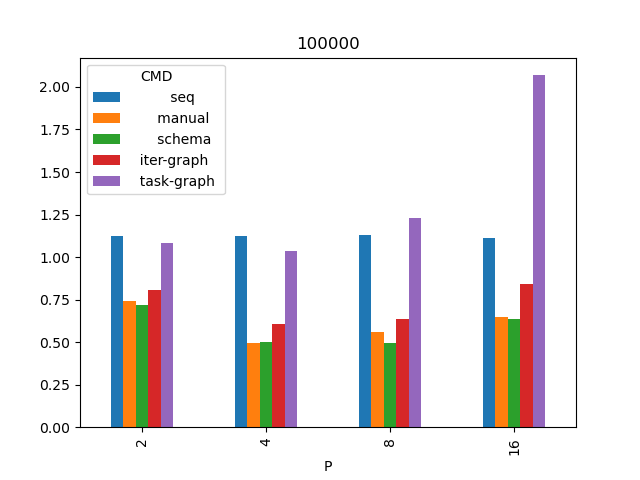

## Результаты

* P - количество исполнителей.
* b - размер одного блока (кол-во ячеек).
* Значения в таблицах - время в секундах.

Список всех запусков [data.csv](data.csv) и итоговые времена [mean.csv](mean.csv)

### Размер сетки 100000
|   P |     b |            seq  |         manual  |         schema  |     iter-graph  |     task-graph  |
|----:|------:|----------------:|----------------:|----------------:|----------------:|----------------:|
|   2 | 50000 |           1.124 |        0.744166 |        0.71937  |        0.804518 |           1.081 |
|   4 | 25000 |           1.124 |        0.49651  |        0.503581 |        0.606051 |           1.035 |
|   8 | 12500 |           1.13  |        0.56205  |        0.495857 |        0.635251 |           1.228 |
|  16 |  6250 |           1.111 |        0.649059 |        0.638398 |        0.844351 |           2.069 |

### Размер сетки 1000000
|   P |      b |            seq  |         manual  |         schema  |     iter-graph  |     task-graph  |
|----:|-------:|----------------:|----------------:|----------------:|----------------:|----------------:|
|   2 | 500000 |          11.135 |           6.339 |           6.353 |           6.524 |           6.686 |
|   4 | 250000 |          11.142 |           3.62  |           3.564 |           3.721 |           4.088 |
|   8 | 125000 |          11.307 |           2.675 |           2.819 |           3.063 |           3.584 |
|  16 |  62500 |          11.138 |           2.436 |           2.542 |           2.742 |           3.543 |

### Размер сетки 10000000
|   P |       b |            seq  |         manual  |         schema  |     iter-graph  |     task-graph  |
|----:|--------:|----------------:|----------------:|----------------:|----------------:|----------------:|
|   2 | 5000000 |         110.788 |          60.058 |          59.924 |          61.314 |          61.989 |
|   4 | 2500000 |         110.921 |          30.869 |          31.112 |          31.765 |          31.662 |
|   8 | 1250000 |         111.964 |          20.34  |          21.112 |          21.763 |          21.345 |
|  16 |  625000 |         111.001 |          17.599 |          18.606 |          17.899 |          18.469 |

