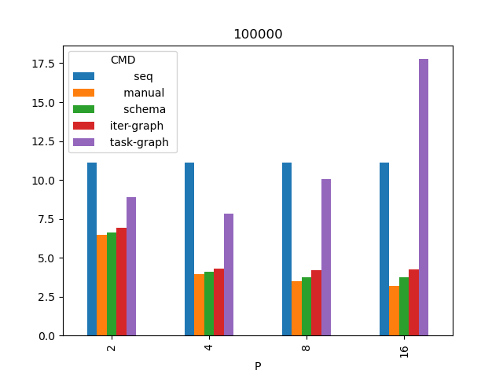
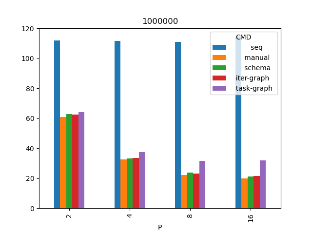
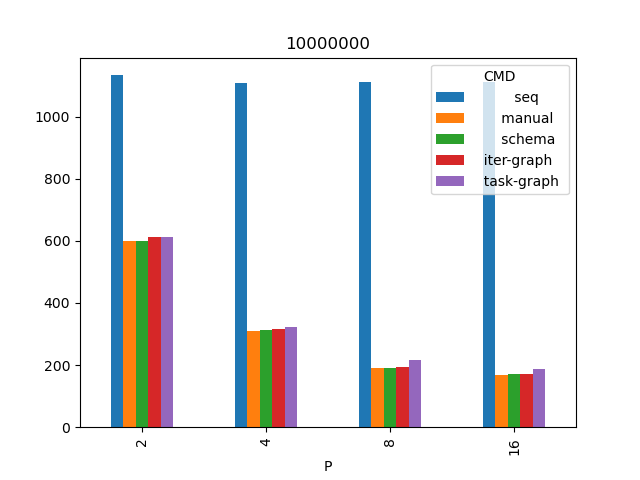

## Результаты

* Кол-во итераций во всех тестах 10000.
* P - количество исполнителей.
* b - размер одного блока (кол-во ячеек).
* Значения в таблицах - время в секундах.
* Запуски проведены в количестве 4х штук и их времена взяты средние.
* Процессор Ryzen 1700x.

Список всех запусков [data.csv](data.csv) и усредненные времена [mean.csv](mean.csv)

### Сетка 100 тысяч узлов

|   P |     b |            seq  |         manual  |         schema  |     iter-graph  |     task-graph  |
|----:|------:|----------------:|----------------:|----------------:|----------------:|----------------:|
|   2 | 50000 |          11.128 |           6.481 |           6.622 |           6.909 |           8.878 |
|   4 | 25000 |          11.099 |           3.943 |           4.084 |           4.302 |           7.809 |
|   8 | 12500 |          11.111 |           3.478 |           3.769 |           4.175 |          10.065 |
|  16 |  6250 |          11.112 |           3.185 |           3.765 |           4.236 |          17.767 |

### Сетка 1 миллион узлов

|   P |      b |            seq  |         manual  |         schema  |     iter-graph  |     task-graph  |
|----:|-------:|----------------:|----------------:|----------------:|----------------:|----------------:|
|   2 | 500000 |         112.066 |          61.004 |          62.757 |          62.694 |          64.201 |
|   4 | 250000 |         111.725 |          32.735 |          33.163 |          33.607 |          37.38  |
|   8 | 125000 |         110.927 |          22.131 |          23.744 |          23.179 |          31.764 |
|  16 |  62500 |         114.53  |          19.84  |          21.252 |          21.567 |          32.051 |

### Сетка 10 миллионов узлов

|   P |       b |            seq  |         manual  |         schema  |     iter-graph  |     task-graph  |
|----:|--------:|----------------:|----------------:|----------------:|----------------:|----------------:|
|   2 | 5000000 |         1133.58 |         601.199 |         598.208 |         611.905 |         613.205 |
|   4 | 2500000 |         1108.32 |         308.327 |         314.07  |         315.138 |         324.004 |
|   8 | 1250000 |         1111.7  |         190.562 |         190.744 |         193.418 |         216.742 |
|  16 |  625000 |         1112.11 |         168.613 |         171.844 |         170.573 |         185.847 |

