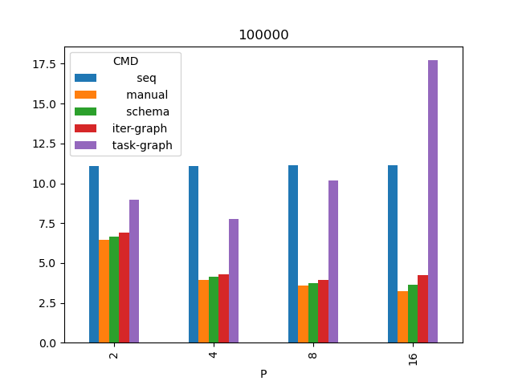

## Результаты

* P - количество исполнителей.
* b - размер одного блока (кол-во ячеек).
* Значения в таблицах - время в секундах.
* Запуски проведены в количестве 4х штук и времена взяты итоговые - минимальные из них.
* Процессор Ryzen 1700x.

Список всех запусков [data.csv](data.csv) и итоговые времена [mean.csv](mean.csv)

# Размер сетки 100000
|   P |     b |            seq  |         manual  |         schema  |     iter-graph  |     task-graph  |
|----:|------:|----------------:|----------------:|----------------:|----------------:|----------------:|
|   2 | 50000 |          11.099 |           6.473 |           6.634 |           6.901 |           8.956 |
|   4 | 25000 |          11.103 |           3.931 |           4.139 |           4.281 |           7.778 |
|   8 | 12500 |          11.116 |           3.581 |           3.737 |           3.95  |          10.181 |
|  16 |  6250 |          11.119 |           3.221 |           3.637 |           4.26  |          17.716 |

# Размер сетки 1000000
|   P |      b |            seq  |         manual  |         schema  |     iter-graph  |     task-graph  |
|----:|-------:|----------------:|----------------:|----------------:|----------------:|----------------:|
|   2 | 500000 |         114.702 |          62.266 |          62.759 |          62.857 |          65.288 |
|   4 | 250000 |         111.372 |          32.746 |          33.17  |          33.613 |          37.239 |
|   8 | 125000 |         111.025 |          22.777 |          24.397 |          23.992 |          31.041 |
|  16 |  62500 |         111.288 |          19.796 |          20.737 |          21.597 |          32.08  |

# Размер сетки 10000000
|   P |       b |            seq  |         manual  |         schema  |     iter-graph  |     task-graph  |
|----:|--------:|----------------:|----------------:|----------------:|----------------:|----------------:|
|   2 | 5000000 |         1115.3  |         595.674 |         598.858 |         614.674 |         615.97  |
|   4 | 2500000 |         1119.88 |         308.515 |         313.652 |         315.275 |         322.925 |
|   8 | 1250000 |         1109.35 |         190.075 |         191.685 |         192.565 |         214.376 |
|  16 |  625000 |         1124.99 |         168.418 |         175.045 |         169.006 |         185.556 |

